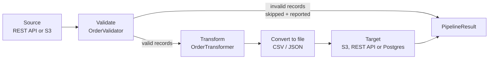

# Architecture

## Pipeline shape

Every connector implements the same five stages. Only the source/target of stages 1 and 5 differ
per connector:



1. **Source** — read raw records from wherever this connector's input is (an external REST API,
   or a file already sitting in S3).
2. **Validate** — `OrderValidator` (in `common`) applies the same business rules everywhere:
   required fields present, `quantity > 0`, `price >= 0`, `orderDate` parseable, `status` (if
   given) one of `NEW/PROCESSING/SHIPPED/DELIVERED/CANCELLED`. Invalid records are **skipped**,
   not fatal — they're counted and listed in the pipeline result instead of aborting the batch.
3. **Transform** — `OrderTransformer` (in `common`) computes `totalAmount = quantity * price`,
   defaults/normalizes `status`, and canonicalizes `orderDate` to `yyyy-MM-dd`.
4. **Convert to file** — `FileConverterService` (in `common`) turns the batch into CSV or JSON
   bytes (`rest-to-s3-connector`), or parses a previously-converted file back into rows
   (`s3-to-rest-connector`). `rest-to-db-connector` skips this stage — it writes rows straight to
   Postgres instead of a file.
5. **Target** — deliver the transformed batch to S3, a target REST API, or Postgres. A
   per-record delivery/persistence failure at this stage is caught, counted, and reported; it does
   not stop the rest of the batch from being delivered.

Every pipeline's `execute()` method returns a `PipelineResult` (`common`) with counts for every
stage plus a `status` of `SUCCESS` / `PARTIAL_SUCCESS` / `FAILED`, so a caller — a human hitting
the endpoint with curl, or an orchestrator polling it — can tell exactly what happened without
reading logs.

## Module layout

```
spring-boot-connectors/
├── common/                     shared library (not independently runnable)
│   ├── http/                   RestApiClient (GET/POST/PUT/PATCH/DELETE) + auth + retry
│   ├── s3/                     S3StorageService + S3Client bean wiring
│   ├── fileconvert/            CSV <-> JSON conversion
│   ├── validate/ transform/    generic validator/transformer contracts
│   ├── order/                  OrderRecord + OrderValidator + OrderTransformer + OrderMapper
│   ├── pipeline/                PipelineResult / PipelineStatus
│   ├── exception/              ConnectorException hierarchy
│   └── web/                    GlobalExceptionHandler, ApiResponse, ErrorResponse
├── rest-to-s3-connector/        source=REST, target=S3
├── s3-to-rest-connector/        source=S3, target=REST
├── rest-to-db-connector/        source=REST, target=Postgres (Flyway-managed schema)
├── docker-compose.yml           postgres + localstack (S3) + wiremock (mock REST APIs) for local runs
└── legacy/                      the pre-existing CRUD demo app, kept for reference only
```

Each connector is an independent, independently deployable Spring Boot application (its own
`main()`, its own port, its own `application.yml`). They share code, not a runtime — nothing
requires all three to be running at once, and there is no in-process coupling between them beyond
the `common` jar.

Each connector's `@SpringBootApplication` sets `scanBasePackages = "com.example.connectors"`
(rather than the default, just its own package) specifically so it also picks up `common`'s beans
(the REST client, the S3 client, `GlobalExceptionHandler`, `OrderValidator`/`OrderTransformer`,
...) without needing a separate auto-configuration module.

## Error handling & logging

- Every internal failure is one of `ValidationException`, `TransformationException`,
  `ExternalServiceException` or `ResourceNotFoundException` (all in `common.exception`, extending
  `ConnectorException`). `GlobalExceptionHandler` (`common.web`, `@RestControllerAdvice`) turns
  each into a consistent JSON error body (`timestamp`, `status`, `error`, `message`, `path`,
  `details`) and an appropriate HTTP status.
- Outbound REST calls (`RestApiClientImpl`) retry transient failures a configurable number of
  times with a fixed backoff (`connector.http.max-retries` / `retry-backoff-ms`) before surfacing
  an `ExternalServiceException`.
- A single bad record (fails validation, fails to deliver/persist) is logged and counted, never
  allowed to fail the rest of the batch — this is what `PipelineResult.recordsInvalid` /
  `recordsFailed` and the `errors` list are for.
- Every connector logs to the console and to a rolling file under `logs/<connector-name>.log`
  (`logback-spring.xml` per module), with `com.example.connectors` at `DEBUG` and everything else
  at `INFO` by default.

## Adding a fourth connector

1. Create a new Maven module, add it to the root `pom.xml`'s `<modules>`, depend on `common`.
2. Add a `@SpringBootApplication(scanBasePackages = "com.example.connectors")` main class.
3. Add `@ConfigurationProperties` classes for whatever source/target you're integrating with —
   follow `SourceRestProperties` / `TargetS3Properties` / `SourceS3Properties` /
   `TargetRestProperties` as templates.
4. Write a `XxxPipelineService` that composes `RestApiClient` / `S3StorageService` /
   `FileConverterService` / `OrderValidator` / `OrderTransformer` (or your own
   `RecordValidator`/`RecordTransformer` if the new connector isn't about orders) and returns a
   `PipelineResult`.
5. Add a thin `@RestController` with `POST /execute` and `GET /health`.
